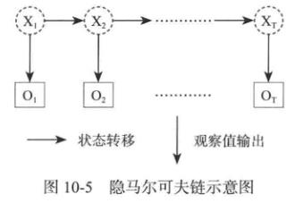
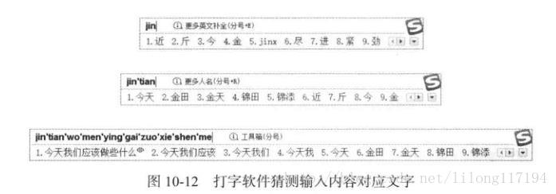
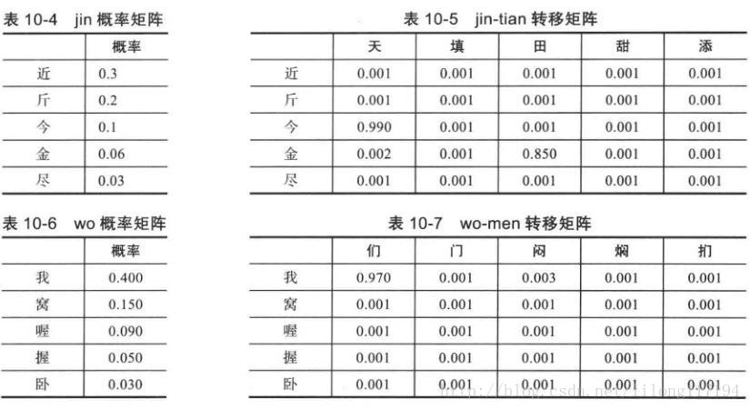

这里首先说下隐马尔可夫模型的相关知识。

1. 隐马尔可夫模型（HMM）
在说隐马尔可夫模型前还有一个概念叫做“马尔科夫链”，既是在给定当前知识或信息的情况下，观察对象过去的历史状态对于预测将来是无关的。也可以说在观察一个系统变化的时候，他的下一个状态如何的概率只需要观察和统计当前的状态即可正确得出。隐马尔可夫链和贝叶斯网络的模型思维有些接近，区别在于隐马尔可夫的模型更为简化。而且隐马尔可夫链是一个双重的随机过程，不仅状态转移之间是一个随机事件，状态和输出之间也是一个随机过程。

如下图： 

在一个完整的观察过程中有一些状态的转换，如X1X1到XTXT的转换存在一个客观的转换规律，但是没办法直接观测到，观测到的只是每个XX状态下的输出OO，通过O1O1到OTOT这些输出值来进行模型建立和计算状态转移的概率。

知乎上一个很好的例子： 
https://www.zhihu.com/question/20962240/answer/33438846

对于HMM来说，如果前提知道所有的隐含状态之间的转换概率和所有隐含状态到所有可见状态之间的输出概率，进行模拟是很容易的。但是往往会缺失一部分信息，如何应用算法去估计缺失的信息，就成为了一个重要的问题。

和HMM模型相关的算法分为3类，分别解决3种问题。

知道隐含状态数量、转换概率、根据可见状态链的结果想知道隐含状态链。这个问题在语音识别领域叫做解码问题，求解这个问题有两种方法。第一种是求最大最大似然状态路径（一串骰子序列，使其产生的观测结果的概率最大）。第二种解法是求每次掷出的骰子分别是某种骰子的概率。
知道隐含状态数量、转换概率、根据可见状态链的结果想知道产生结果的概率。这个问题的实际意义在于检测观察到的模型是否和已知的模型吻合。如果很多次结果都是对应了比较小的概率，那么就说明已知的模型很可能是错的。
知道隐含状态数量、不知道转换概率、根据可见状态链的结果想反推出转换概率。这个问题是最重要的，因为是最为常见的。很多时候只有可见结果，不知道HMM模型中的参数，需要从可见结果估计这些参数。
2. 维特比算法
当马尔科夫链很长时，根据古典概型的分布特点来计算概率时穷举的数量太大，就很难得到结果。这时就要用到维特比算法。维特比算法就是为了找出可能性最大的隐藏序列，即刚刚提到的第一个问题。这种算法是一种链的可能性问题，现在应用最广泛的是CDMA和打字提示功能。

维特比算法的整体思路是寻找上一段信息和它跟随的下一段信息的转换概率问题。

2.1 打字输入提示应用

这是常用的搜狗输入法的示例。在本例中只是考虑最简单的因素，下面是模拟输入法的猜测方法给出一个算法示例，先给出各级转换矩阵。如下：

其实这些概率矩阵都是由统计产生，而且每个双字词、三字词等的输入矩阵都由这种统计产生。在输入双字词汉子拼音时会根据转移概率表进行计算。多个词相连就是多个转移矩阵的概率相乘计算，从而得到概率最大的输入可能项。

